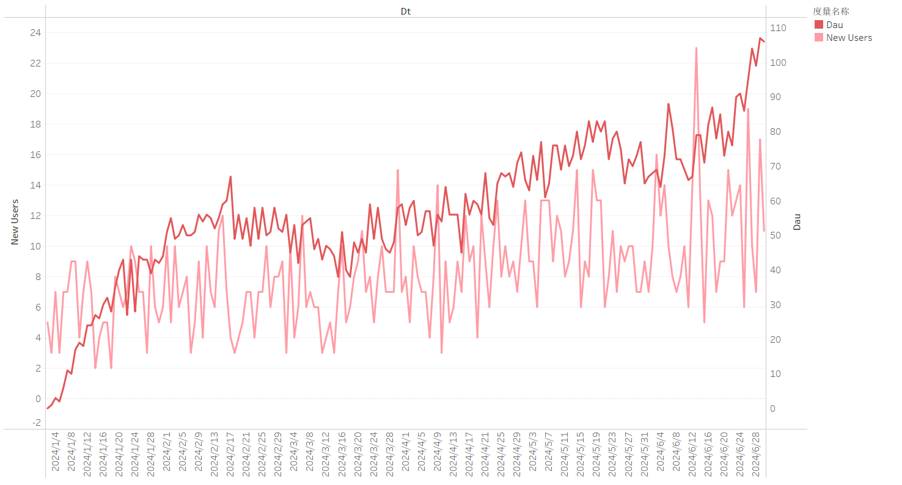
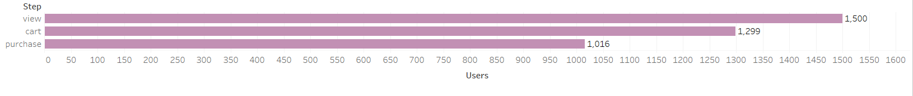
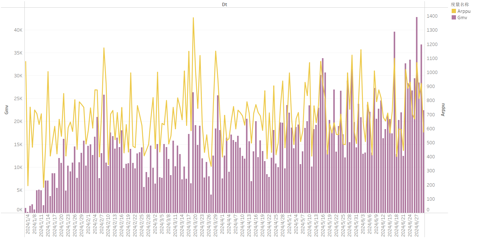

#  E-commerce User Behavior & Conversion Analysis (SQL)

## 1. Project Background

This project analyzes e-commerce user behavior data (view, cart, purchase) and order data to build a comprehensive analytics framework. The goal is to identify key growth bottlenecks and provide data-driven optimization insights.

---

## 2. Data Description

| Table | Description |
|------|-------------|
| users | User registration data (user_id, register_date) |
| user_behavior | User activity logs (view / cart / purchase) |
| orders | Order data (order_id, user_id, amount, order_time) |
| order_items | Order details (order_id, product_id, quantity) |
| products | Product information (product_id, category, price) |
| ab_test | A/B testing data (user_id, experiment_group, is_exposed, is_clicked, is_purchased, revenue) |

---

## 3. Analytical Framework

The project covers the following analytical modules:

1. User Growth & Activity (New Users, DAU)  
2. User Retention (Day 1, Day 7)  
3. Conversion Funnel (view  →  cart  →  purchase)  
4. Revenue Analysis (GMV, ARPPU)  
5. User Lifecycle Analysis  
6. User Value Analysis (RFM Model)  
7. A/B Testing Analysis  
8. User Segmentation (New vs Returning Users)  

---

## 4. Key Analysis

### 4.1 User Growth & Activity

DAU shows a consistent upward trend, indicating that the platform is in a growth phase with increasing user engagement.

---

### 4.2 User Retention

- Day 1 retention: moderate (approximately 30%–70%)  
- Day 7 retention: significantly lower  

Insight:
- Users are attracted initially but fail to retain long-term  
- Indicates insufficient product stickiness  

---

### 4.3 Conversion Funnel

view  →  cart  →  purchase

Conversion rates:

- View  →  Cart  ≈  86%  
- Cart  →  Purchase  ≈  77%  

Insight:

- Conversion funnel performs exceptionally well  
- No significant drop-off across stages  
- **Conversion is not the primary issue**

---

### 4.4 Revenue Analysis

- GMV shows a steady upward trend  
- ARPPU is also increasing  

Insight:

- Revenue growth is stable  
- User monetization capability is improving  

---

### 4.5 User Lifecycle Analysis

Identified:

- Continuously active users  
- Returning users  
- Silent users  

Used to understand user engagement patterns and churn behavior  

---

### 4.6 User Value Analysis (RFM)

- High-value users (F  ≥  3 & M  ≥  500): **489 users**

Insight:

- A solid base of high-value users supports revenue growth  
- User structure is relatively healthy  

---

### 4.7 A/B Testing Analysis

| Group | CTR | CVR |
|------|-----|-----|
| A | 0.8408 | 0.6564 |
| B | 0.8571 | 0.6684 |

Insight:

- Group B outperforms Group A in both CTR and CVR  
- Indicates that the optimization strategy is effective  

---

### 4.8 User Segmentation (New vs Returning Users)

- New users show lower conversion compared to returning users  
- Returning users behave more consistently  

Insight:

- New users are the key segment for improvement  

---

## 5. Key Findings  

### 1.Overall Growth is Healthy

- DAU and GMV are both increasing  
- High-value users (489) contribute significantly to revenue  

---

### 2.Conversion Funnel is Strong

- Conversion rates are significantly higher than typical benchmarks  
- No major bottlenecks in the conversion process  

**Conclusion: The issue is NOT conversion**

---

### 3.Retention is the Core Problem

- Moderate Day 1 retention  
- Significant drop in Day 7 retention  

  Indicates weak long-term user engagement  

---

### 4.New Users are the Main Bottleneck

- Lower conversion rates compared to returning users  
- Retention drop is concentrated in early-stage users  

 Growth issue is essentially a **new user problem**

---

### 5. A/B Testing Confirms Optimization Direction

- Group B shows improvement in both CTR and CVR  
- Validates effectiveness of optimization strategies  

---

###    Final Conclusion

**The main issue lies in user retention, especially among new users, rather than the conversion process. Improving new user experience and long-term engagement is critical for growth.**

---

## 6. Recommendations

1. Improve onboarding experience for new users (increase Day 1 retention)  
2. Enhance product discovery and recommendation systems  
3. Strengthen user engagement mechanisms (e.g., promotions, notifications)  
4. Simplify user journey and reduce friction  
5. Apply user segmentation for targeted operations  

---

## 7. Project Summary

This project builds a complete e-commerce analytics framework and identifies business bottlenecks through:

- Retention & funnel combined analysis  
- User segmentation  
- A/B testing validation  

### Key Skills Demonstrated:

- SQL-based data analysis  
- User behavior analysis  
- Business problem diagnosis  
- Data-driven decision making  

---

## 8. Tech Stack

- SQL (MySQL)  
- Excel  
- Tableau (used for exploratory analysis, not primary output)

##    Dashboard Preview

### User Growth

### Funnel

### Revenue

