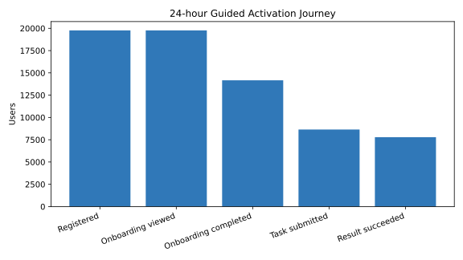
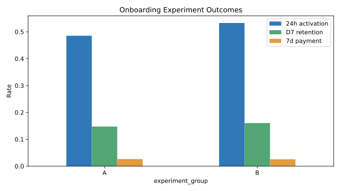

# AI Product Activation & Retention Growth Analysis

An end-to-end simulated growth analytics project for an AI assistant with chat, writing, image-generation and document-analysis features. The project starts with a tracking plan, validates event quality, diagnoses activation and retention, segments users and evaluates an onboarding experiment.

> The dataset is synthetic and reproducible. All business results below are simulated for analytical practice rather than claims about a real product.

## Business question

New-user acquisition is growing, but not every registered user reaches the product's core value. The project asks:

1. Where do new users drop before receiving their first useful AI result?
2. Which acquisition channels and first-use behaviors are associated with stronger retention?
3. Can personalized onboarding increase activation without harming retention or payment conversion?
4. How should users be segmented for activation, engagement and reactivation operations?

## Growth framework

**North-star metric:** weekly users who complete at least two successful AI tasks.

**24-hour activation:** a registered user receives at least one server-confirmed `result_success` within 24 hours.

The analysis separates the guided activation journey from the commercial journey:

```text
Registration -> onboarding -> core task -> successful result
Successful result -> retained use -> paywall -> subscription
```

The full definitions, event ownership and data-quality rules are documented in [tracking_plan.md](tracking_plan.md).

## Data model

| Table | Grain | Main fields |
|---|---|---|
| `users` | One row per user | registration time, channel, device, city tier, referrer |
| `events` | One row per event | event name/time, session, feature, status, latency, app version |
| `ab_assignments` | One row per user and experiment | assignment time and experiment group |
| `subscriptions` | One row per successful subscription | payment time, plan and revenue |

The generator creates 20,000 users, 313,894 product events and 625 subscriptions across a 90-day observation period. Recent cohorts are deliberately right-censored so retention queries must exclude incomplete windows.

## Verified findings

### Activation journey

Among users with a complete 24-hour observation window:

- 71.7% completed onboarding.
- 61.0% of onboarding completers submitted a core task through the guided path.
- 90.1% of guided-path task submitters received a successful result.

The largest controllable loss occurs before task submission, so feature selection and first-use guidance are stronger initial levers than result delivery reliability.



### Acquisition quality

Referral users had the strongest 24-hour activation rate at 56.7%, while paid-social users had the largest volume but the weakest activation rate at 45.5%. This suggests channel evaluation should use downstream activation and retention, not registrations alone.

### Onboarding experiment

Control A used the default homepage. Treatment B asked users to select a goal and then recommended a matching feature template.

| Metric | A | B | Absolute lift | p-value | Interpretation |
|---|---:|---:|---:|---:|---|
| 24-hour activation | 48.24% | 53.17% | +4.94 pp | <0.001 | Significant improvement |
| D7 retained use | 14.76% | 16.06% | +1.30 pp | 0.0145 | Significant overall improvement |
| D7 retention among activated users | 27.06% | 27.30% | +0.24 pp | 0.7902 | No evidence of deeper retention improvement |
| Seven-day payment | 2.65% | 2.57% | -0.09 pp | 0.7168 | No meaningful difference |

The sample-ratio-mismatch check passed (`p=0.4883`). The experiment increased the number of users reaching first value, which lifted overall D7 retained use, but it did not improve retention conditional on activation or short-term payment. A follow-up experiment should focus on the second successful use case rather than adding more onboarding steps.



## Growth recommendations

1. Roll out personalized onboarding while continuing to monitor result failures and payment conversion as guardrails.
2. Add a post-activation recommendation that introduces a second relevant use case; evaluate retained successful use rather than app opens.
3. Optimize paid-social targeting and landing-message consistency using 24-hour activation as a channel-quality metric.
4. Test a result-sharing referral loop because referral users show the strongest downstream quality.
5. Trigger scenario-based reminders for activated users who have not completed a second successful task within three days.

## Repository structure

```text
generate_data.py       Synthetic users, event logs, subscriptions and experiment assignment
validate_data.py       Tracking integrity and event-order checks
schema.sql             MySQL 8.0 table definitions
growth_analysis.sql    North star, funnel, channel, cohort, lifecycle and RFE analysis
ab_analysis.py         SRM, confidence intervals and two-proportion tests
build_outputs.py       Dashboard extracts and GitHub preview charts
tracking_plan.md       Metric definitions, event dictionary and QA rules
outputs/               Tableau-ready summary tables
```

## Run locally

```bash
python -m pip install -r requirements.txt
python generate_data.py
python validate_data.py
python ab_analysis.py
python build_outputs.py
```

The generated CSV files are intentionally excluded from version control. Running `generate_data.py` with the fixed seed reproduces the analyzed dataset.

## Skills demonstrated

- Product tracking design and data-quality validation
- Activation funnel and time-to-first-value analysis
- Cohort retention with complete observation windows
- Acquisition-channel quality and lifecycle segmentation
- RFE-based user value segmentation
- A/B experiment design, SRM checks and significance testing
- SQL, Python, pandas, SciPy and dashboard-data preparation
